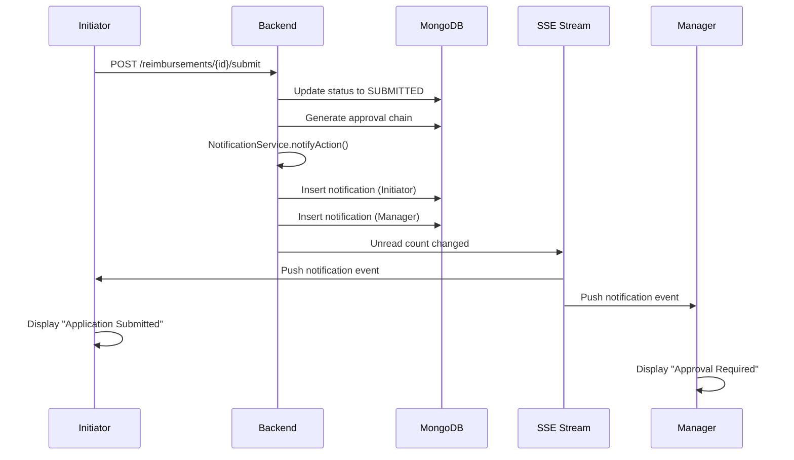
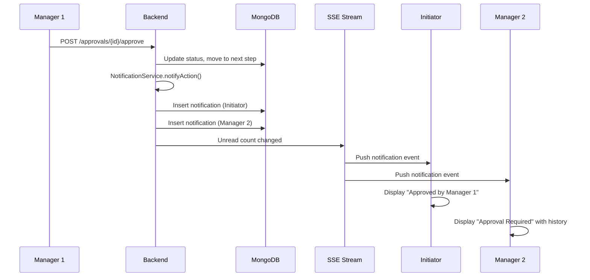

# Reimbursement Notification System with Server-Sent Events

## Overview

The Expense Manager notification system delivers instant updates to users about reimbursement lifecycle events. The system uses **Server-Sent Events (SSE)** for real-time push notifications from server to client, eliminating the need for continuous polling and reducing server load while providing immediate feedback.

---

## Table of Contents

1. [System Architecture](#system-architecture)
2. [Technology Choice: SSE](#technology-choice-sse)
3. [Notification Types & Templates](#notification-types--templates)
4. [Color Scheme](#color-scheme)
5. [Database Schema](#database-schema)
6. [Backend Components](#backend-components)
7. [Frontend Components](#frontend-components)
8. [Implementation Flow](#implementation-flow)
9. [API Reference](#api-reference)

---

## System Architecture

### Current State (Polling-Based)

The existing system uses REST polling where the client repeatedly requests notification updates:

```
┌─────────────┐                    ┌──────────────┐
│   Client    │─── Poll Every ────▶│   Backend    │
│             │    30 seconds       │              │
│             │◀─── Response ───────│ GET /unread  │
└─────────────┘                    └──────────────┘
```

**Limitations**:
- Delayed updates (30-second intervals)
- Unnecessary server requests when no changes
- Higher bandwidth consumption
- Increased server processing for empty responses

### Target State (SSE-Based)

The new system establishes a persistent connection where the server pushes updates immediately:

```
┌─────────────┐                    ┌──────────────┐
│   Client    │─── Open Stream ───▶│   Backend    │
│             │                     │              │
│ EventSource │◀── Push Update ────│ SSE Endpoint │
│             │    (Immediate)      │              │
└─────────────┘                    └──────────────┘
```

**Benefits**:
- Instant notifications (no delay)
- Reduced server load (no polling)
- Lower bandwidth usage
- Better user experience

---

## Technology Choice: SSE

### Why Server-Sent Events?

Server-Sent Events is the optimal choice for unidirectional server-to-client notifications:

| Feature | SSE | WebSocket | Polling |
|---------|-----|-----------|---------|
| Direction | Server → Client | Bidirectional | Client → Server |
| Real-time updates | ✅ Yes | ✅ Yes | ❌ Delayed |
| Auto-reconnection | ✅ Built-in | ❌ Manual | N/A |
| Complexity | 🟢 Simple | 🟡 Moderate | 🟢 Simple |
| Overhead | 🟢 Low | 🟢 Low | 🔴 High |
| Browser support | ✅ All modern | ✅ All modern | ✅ Universal |

### Key Advantages

1. **Unidirectional Communication**: Perfect for notifications where only server needs to send data
2. **HTTP-Based**: Works over standard HTTP/HTTPS without special protocols
3. **Automatic Reconnection**: Browser automatically reconnects on connection drop
4. **Text-Based Protocol**: Simple `text/event-stream` format
5. **Lower Complexity**: No handshake protocol, simpler than WebSockets

---

## Notification Types & Templates

Each reimbursement lifecycle event triggers specific notification templates with relevant information.

### 1. Submitted - Application Received

**Trigger**: When initiator submits a reimbursement

#### To Initiator

```html
<div class="notification-card status-submitted">
  <h3>Application Submitted</h3>
  <p><strong>Reimbursement ID:</strong> RB-2026-000123</p>
  <p><strong>Applicant:</strong> John Doe</p>
  <p><strong>Categories:</strong> Travel, Accommodation, Food</p>
  <p><strong>Total Amount:</strong> ₹15,450.00</p>
  <p><strong>Submitted:</strong> 13 Jun 2026, 10:30 AM</p>
</div>
```

**Data Fields**:
- Reimbursement ID
- Initiator name
- Categories (comma-separated)
- Total amount (sum of all items)
- Submission date with timestamp

#### To First Manager

```html
<div class="notification-card status-approval-required">
  <h3>Approval Required</h3>
  <p><strong>Reimbursement ID:</strong> RB-2026-000123</p>
  <p><strong>Applicant:</strong> John Doe</p>
  <p><strong>Categories:</strong> Travel, Accommodation, Food</p>
  <p><strong>Total Amount:</strong> ₹15,450.00</p>
  <p><strong>Submitted:</strong> 13 Jun 2026</p>
  <p><strong>Due Date:</strong> 16 Jun 2026</p>
</div>
```

**Data Fields**:
- Reimbursement ID
- Initiator name
- Categories (comma-separated)
- Total amount
- Submission date
- Due date (submission + review_days from env)

---

### 2. Manager Approved - Escalation

**Trigger**: When a manager approves and moves to next level

#### To Next Manager (with History)

```html
<div class="notification-card status-approval-required">
  <h3>Approval Required</h3>
  <p><strong>Reimbursement ID:</strong> RB-2026-000123</p>
  <p><strong>Applicant:</strong> John Doe</p>
  <p><strong>Categories:</strong> Travel, Accommodation, Food</p>
  <p><strong>Total Amount:</strong> ₹15,450.00</p>
  <p><strong>Submitted:</strong> 13 Jun 2026</p>
  <p><strong>Due Date:</strong> 16 Jun 2026</p>

  <div class="approval-history">
    <h4>Approval History</h4>
    <table>
      <tr>
        <th>Reviewer</th>
        <th>Received</th>
        <th>Approved</th>
      </tr>
      <tr>
        <td>John Doe (Initiator)</td>
        <td>-</td>
        <td>13 Jun 2026, 10:30 AM</td>
      </tr>
      <tr>
        <td>Sarah Manager</td>
        <td>13 Jun 2026, 11:00 AM</td>
        <td>14 Jun 2026, 09:15 AM</td>
      </tr>
    </table>
  </div>
</div>
```

**Data Fields**:
- All fields from first approval
- Approval history table:
  - Reviewer name (initiator + previous reviewers)
  - Received date (when reviewer first viewed)
  - Approved date (when action was taken)

---

### 3. Query Raised by Manager

**Trigger**: When any manager raises a query

#### To Initiator

```html
<div class="notification-card status-query">
  <h3>Query Raised by Sarah Manager</h3>
  <p><strong>Reimbursement ID:</strong> RB-2026-000123</p>
  <p><strong>Query:</strong> Please provide additional invoice for the accommodation expense dated 10 Jun 2026.</p>
  <p><strong>Due Date:</strong> 15 Jun 2026</p>
</div>
```

**Data Fields**:
- Manager name (who raised query)
- Reimbursement ID
- Query message from manager
- Due date for response

---

### 4. Private Ask by Manager

**Trigger**: When manager raises a private question

#### To Initiator

```html
<div class="notification-card status-ask">
  <h3>Private Message from Sarah Manager</h3>
  <p><strong>Reimbursement ID:</strong> RB-2026-000123</p>
  <p><strong>Message:</strong> Could you clarify the purpose of the additional meal expenses on 11 Jun?</p>
  <p><strong>Due Date:</strong> 15 Jun 2026</p>
</div>
```

**Data Fields**:
- Manager name
- Reimbursement ID
- Private message from manager
- Due date for response

**Note**: This notification is visible ONLY to initiator and Owner (not other managers).

---

### 5. Approved by Manager

**Trigger**: When manager approves a reimbursement

#### To Initiator

```html
<div class="notification-card status-approved">
  <h3>Approved by Sarah Manager</h3>
  <p><strong>Reimbursement ID:</strong> RB-2026-000123</p>
  <p><strong>Reviewer:</strong> Sarah Manager</p>
  <p><strong>Total Amount:</strong> ₹15,450.00</p>
  <p><strong>Categories:</strong> Travel, Accommodation, Food</p>
  <p><strong>Approved:</strong> 14 Jun 2026, 09:15 AM</p>
</div>
```

**Data Fields**:
- Manager name
- Reimbursement ID
- Total amount
- Categories
- Approval date with timestamp

---

### 6. Payment Disbursed

**Trigger**: When Accountant marks as PAID

#### To Initiator

```html
<div class="notification-card status-paid">
  <h3>Payment Disbursed</h3>
  <p><strong>Reimbursement ID:</strong> RB-2026-000123</p>
  <p><strong>Amount Paid:</strong> ₹15,450.00</p>
  <p><strong>Categories:</strong> Travel, Accommodation, Food</p>
  <p><strong>Payment Date:</strong> 15 Jun 2026, 02:30 PM</p>
  <p class="action-required">Please acknowledge receipt of payment.</p>
</div>
```

**Data Fields**:
- Reimbursement ID
- Total amount paid
- Categories
- Payment date with timestamp

---

### 7. Reimbursement Rejected

**Trigger**: When Accountant rejects the reimbursement

#### To Initiator

```html
<div class="notification-card status-rejected">
  <h3>Reimbursement Rejected</h3>
  <p><strong>Reimbursement ID:</strong> RB-2026-000123</p>
  <p><strong>Reason:</strong> Insufficient documentation provided for travel expenses. Policy violation on meal allowance limits.</p>
  <p><strong>Total Amount:</strong> ₹15,450.00</p>
  <p><strong>Categories:</strong> Travel, Accommodation, Food</p>
  <p><strong>Rejected:</strong> 15 Jun 2026, 11:00 AM</p>
</div>
```

**Data Fields**:
- Reimbursement ID
- Rejection reason (message from accountant)
- Total amount
- Categories
- Rejection date with timestamp

---

## Color Scheme

Each notification status uses a distinct color to provide immediate visual feedback:

| Status | Color | Hex Code | Usage |
|--------|-------|----------|-------|
| **Submitted** | Blue | `#3B82F6` | Initial submission, informational |
| **Query Raised** | Yellow | `#EAB308` | Requires attention and response |
| **Private Ask** | Amber | `#F59E0B` | Private message, urgent attention |
| **Approved** | Green | `#10B981` | Positive action, progress |
| **Paid** | Emerald | `#059669` | Success, payment received |
| **Rejected** | Red | `#EF4444` | Negative action, terminal state |
| **Query Answer** | Light Amber | `#FCD34D` | Response to query, pending review |

### CSS Classes

```css
.notification-card {
  border-left: 4px solid;
  padding: 16px;
  border-radius: 8px;
  margin-bottom: 12px;
}

.status-submitted {
  border-color: #3B82F6;
  background: linear-gradient(to right, #EFF6FF, #DBEAFE);
}

.status-query {
  border-color: #EAB308;
  background: linear-gradient(to right, #FEFCE8, #FEF3C7);
}

.status-ask {
  border-color: #F59E0B;
  background: linear-gradient(to right, #FFFBEB, #FED7AA);
}

.status-approved {
  border-color: #10B981;
  background: linear-gradient(to right, #ECFDF5, #D1FAE5);
}

.status-paid {
  border-color: #059669;
  background: linear-gradient(to right, #F0FDF4, #DCFCE7);
}

.status-rejected {
  border-color: #EF4444;
  background: linear-gradient(to right, #FEF2F2, #FEE2E2);
}

.status-query-answer {
  border-color: #FCD34D;
  background: linear-gradient(to right, #FEFCE8, #FEF9C3);
}
```

---

## Database Schema

### Notification Document


```javascript
{
  "_id": ObjectId("..."),
  "user_id": "user123",              // Recipient
  "type": "SUBMITTED",               // Notification type
  "title": "Application Submitted",  // Notification heading
  "message": "...",                  // Plain text message (deprecated)
  "html_content": "<div>...</div>",  // NEW: Rich HTML template
  "reimbursement_id": "reimb456",    // Reference to reimbursement
  "metadata": {                      // NEW: Additional data for template
    "initiator_name": "John Doe",
    "categories": ["Travel", "Food"],
    "total_amount": 15450.00,
    "submission_date": "2026-06-13T10:30:00Z",
    "due_date": "2026-06-16T10:30:00Z",
    "manager_name": "Sarah Manager",
    "approval_history": [...]
  },
  "is_read": false,
  "created_at": "2026-06-13T10:30:15Z"
}
```

### Key Changes from Current Schema

| Field | Current | New | Purpose |
|-------|---------|-----|---------|
| `message` | Plain text | Deprecated | Simple text message |
| `html_content` | - | **NEW** | Rich HTML notification template |
| `metadata` | - | **NEW** | Structured data for template rendering |

---

## Backend Components

### 1. Notification Templates (`controllers/NotificationTemplates.py`)

Generates HTML templates for each notification type:

```python
class NotificationTemplates:
    """HTML template generator for reimbursement notifications"""

    @staticmethod
    def submitted_to_initiator(data: dict) -> str:
        """Template for initiator when reimbursement is submitted"""

    @staticmethod
    def approval_required(data: dict) -> str:
        """Template for manager approval request"""

    @staticmethod
    def approval_required_with_history(data: dict) -> str:
        """Template for escalated approvals with history"""

    @staticmethod
    def query_raised(data: dict) -> str:
        """Template when manager raises query"""

    @staticmethod
    def private_ask(data: dict) -> str:
        """Template for private ask from manager"""

    @staticmethod
    def approved(data: dict) -> str:
        """Template when manager approves"""

    @staticmethod
    def payment_disbursed(data: dict) -> str:
        """Template when payment is made"""

    @staticmethod
    def rejected(data: dict) -> str:
        """Template when reimbursement is rejected"""
```

### 2. Enhanced Notification Service (`controllers/NotificationService.py`)

Updated to use templates and generate rich notifications:

```python
def notifyAction(
    dictReimbursement: dict,
    strAction: str,
    strActorId: str,
    strMessage: str = "",
    strVisibility: str = "public",
) -> None:
    """Generate and send notifications with HTML templates"""

    # Build metadata from reimbursement
    dictMetadata = _buildMetadata(dictReimbursement, strAction, strActorId, strMessage)

    # Generate HTML template based on action
    strHtmlContent = NotificationTemplates.get_template(strAction, dictMetadata)

    # Insert notification with HTML content
    _insertNotification(
        user_id=strTargetUserId,
        notification_type=strAction,
        title=strTitle,
        html_content=strHtmlContent,
        metadata=dictMetadata,
        reimbursement_id=strReimbId
    )
```

### 3. SSE Endpoint (`routes/notification_sse_routes.py`)

Streams real-time notification updates:

```python
@router.get("/stream")
async def notification_stream(
    request: Request,
    token: str = Query(..., description="JWT token for authentication")
):
    """
    Server-Sent Events endpoint for real-time notifications.

    Query Parameters:
        token: JWT authentication token (EventSource cannot send headers)

    Returns:
        StreamingResponse with text/event-stream
    """
    # Validate JWT token from query parameter
    user_data = validate_token(token)
    user_id = user_data["user_id"]

    # Return SSE streaming response
    return StreamingResponse(
        notification_event_generator(request, user_id),
        media_type="text/event-stream",
        headers={
            "Cache-Control": "no-cache",
            "Connection": "keep-alive",
            "X-Accel-Buffering": "no"
        }
    )
```

### 4. SSE Event Generator

```python
async def notification_event_generator(
    request: Request,
    user_id: str
) -> AsyncGenerator[str, None]:
    """
    Generate SSE events for notification updates.

    Checks for new notifications every 5 seconds and pushes
    updates when unread count changes.
    """
    previous_count = -1

    try:
        while True:
            # Check if client disconnected
            if await request.is_disconnected():
                break

            # Get current unread count
            current_count = await get_unread_count(user_id)

            # Only send event if count changed
            if current_count != previous_count:
                event_data = {
                    "event_type": "count_update",
                    "unread_count": current_count,
                    "has_new": current_count > previous_count and previous_count >= 0
                }

                # Format as SSE event
                yield f"data: {json.dumps(event_data)}\n\n"
                previous_count = current_count

            # Wait before next check
            await asyncio.sleep(5)  # 5 second interval

    except asyncio.CancelledError:
        pass  # Normal disconnection
```

---

## Frontend Components

### 1. SSE Connection Service (`client/src/services/notificationSSE.ts`)

Manages SSE connection lifecycle:

```typescript
let eventSource: EventSource | null = null;

export const connectNotificationStream = (
  onUpdate: (data: NotificationUpdate) => void,
  onError?: (error: Event) => void
): void => {
  // Get JWT token
  const token = localStorage.getItem('authToken');
  if (!token) return;

  // Build SSE URL with token as query parameter
  const url = `${API_BASE}/api/notifications/stream?token=${token}`;

  // Create EventSource connection
  eventSource = new EventSource(url);

  // Handle messages
  eventSource.onmessage = (event) => {
    const data = JSON.parse(event.data);
    onUpdate(data);
  };

  // Handle errors (auto-reconnects)
  eventSource.onerror = (error) => {
    console.error('[SSE] Connection error:', error);
    if (onError) onError(error);
  };
};

export const disconnectNotificationStream = (): void => {
  if (eventSource) {
    eventSource.close();
    eventSource = null;
  }
};
```

### 2. Notification Component (`client/src/components/NotificationBell.tsx`)

Bell icon with SSE integration:

```typescript
export const NotificationBell = () => {
  const [unreadCount, setUnreadCount] = useState(0);
  const [notifications, setNotifications] = useState<Notification[]>([]);

  useEffect(() => {
    // Connect to SSE stream
    connectNotificationStream((event) => {
      if (event.event_type === 'count_update') {
        setUnreadCount(event.unread_count);

        // Play sound if new notification
        if (event.has_new) {
          playNotificationSound();
        }

        // Refresh notification list
        refreshNotifications();
      }
    });

    // Cleanup on unmount
    return () => {
      disconnectNotificationStream();
    };
  }, []);

  return (
    <div className="notification-bell">
      <Bell size={24} />
      {unreadCount > 0 && (
        <span className="badge">{unreadCount}</span>
      )}
    </div>
  );
};
```

### 3. Notification List (`client/src/pages/NotificationsPage.tsx`)

Renders HTML notification templates:

```typescript
export const NotificationsPage = () => {
  const [notifications, setNotifications] = useState<Notification[]>([]);

  return (
    <div className="notifications-page">
      {notifications.map((notif) => (
        <div
          key={notif.notification_id}
          className={`notification-item ${notif.is_read ? 'read' : 'unread'}`}
          onClick={() => handleNotificationClick(notif)}
        >
          {/* Render HTML content from backend */}
          <div
            dangerouslySetInnerHTML={{ __html: notif.html_content }}
          />
        </div>
      ))}
    </div>
  );
};
```

---

## Implementation Flow

### 1. Reimbursement Submitted



### 2. Manager Approves



---

## API Reference

### SSE Endpoint

**Endpoint**: `GET /api/notifications/stream`

**Query Parameters**:
| Parameter | Type | Required | Description |
|-----------|------|----------|-------------|
| `token` | string | Yes | JWT authentication token |

**Response**: `text/event-stream`

**Event Format**:
```json
{
  "event_type": "count_update",
  "unread_count": 5,
  "has_new": true
}
```

### REST Endpoints

**List Notifications**: `GET /api/notifications/list`

**Query Parameters**:
| Parameter | Type | Default | Description |
|-----------|------|---------|-------------|
| `limit` | integer | 50 | Max notifications to return |
| `unread_only` | boolean | false | Filter unread only |

**Response**:
```json
{
  "notifications": [
    {
      "notification_id": "...",
      "user_id": "...",
      "type": "SUBMITTED",
      "title": "Application Submitted",
      "html_content": "<div>...</div>",
      "metadata": {...},
      "reimbursement_id": "...",
      "is_read": false,
      "created_at": "2026-06-13T10:30:15Z"
    }
  ],
  "unread_count": 5
}
```

**Mark as Read**: `POST /api/notifications/mark-read`

**Request Body**:
```json
{
  "notification_ids": ["notif1", "notif2"],
  "mark_all": false
}
```

---

## Configuration

### Environment Variables

```env
# SSE check interval (seconds)
SSE_CHECK_INTERVAL=5

# Notification sound enabled by default
NOTIFICATION_SOUND_ENABLED=true

# Review days for due date calculation
REIMBURSEMENT_REVIEW_DAYS=3
SLA_QUERY_RESPONSE_DAYS=2
```

### Router Registration Order

**Critical**: SSE router must be registered BEFORE notification routes with catch-all patterns:

```python
# main.py
app.include_router(notification_sse_routes.router)  # FIRST
app.include_router(notification_routes.router)      # SECOND
```

---

## Summary

The enhanced notification system provides:

✅ **Real-time updates** via Server-Sent Events
✅ **Rich HTML templates** for each reimbursement status
✅ **Color-coded visual feedback** for instant recognition
✅ **Automatic reconnection** on connection drop
✅ **Lower server load** compared to polling
✅ **Immediate notifications** without delays
✅ **Approval history** in escalated notifications
✅ **Production-ready** SSE implementation

This ensures users receive instant, informative notifications throughout the reimbursement lifecycle.

